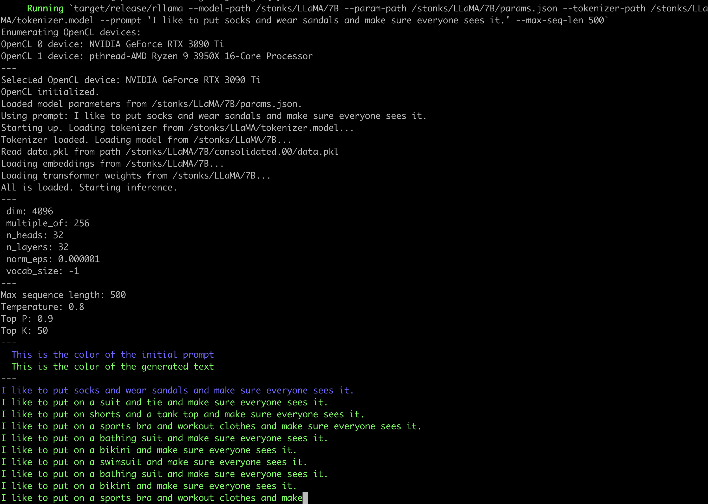

# RLLaMA

This is my attempt at making the LLaMA language model working on a pure Rust
CPU implementation. I was inspired by an amazing CPU implementation here:
https://github.com/ggerganov/ggml that could run GPT-J 6B models.

The current performance is as follows:

```
LLaMA-7B:  AMD Ryzen 3950X:                       552ms / token     f16    (pure Rust)
LLaMA-7B:  AMD Ryzen 3950X:                       1008ms / token    f32    (pure Rust)
LLaMA-13B: AMD Ryzen 3950X:                       1029ms / token    f16    (pure Rust)
LLaMA-13B: AMD Ryzen 3950X:                       1930ms / token    f32    (pure Rust)
LLaMA-30B: AMD Ryzen 5950X:                       2112ms / token    f16    (pure Rust)

LLaMA-7B:  AMD Ryzen 3950X + OpenCL GTX 3090 Ti:  247ms / token            (OpenCL on GPU)
LLaMA-7B:  AMD Ryzen 3950X + OpenCL Ryzen 3950X:  680ms / token            (OpenCL on CPU)
LLaMA-13B: AMD Ryzen 3950X + OpenCL GTX 3090 Ti:  <I ran out of GPU memory :(>
LLaMA-13B: AMD Ryzen 3950X + OpenCL Ryzen 3950X:  1232ms / token           (OpenCL on CPU)
LLaMA-30B: AMD Ryzen 5950X + OpenCL Ryzen 5950X:  4098ms / token           (OpenCL on CPU)
```

(Scroll to the bottom to see benchmarks over time).

I have not tried to run LLaMA-60B but I think it would work if you got a big
enough computer.

It also has a Python unpickler that understands the `.pth` files used by
PyTorch. Well almost, it doesn't unzip them automatically (see below).

# How to run

You will need Rust. Make sure you can run `cargo` from a command line. In
particular, this is using unstable features so you need nightly rust. Make sure
that if you write `cargo --version` it shows that it is nightly Rust.

You will need to download LLaMA-7B weights. Refer to https://github.com/facebookresearch/llama/

Once you have 7B weights, and the `tokenizer.model` it comes with, you need to
decompress it.

```shell
$ cd LLaMA
$ cd 7B
$ unzip consolidated.00.pth
# For LLaMA-7B, rename consolidated to consolidated.00
# For the larger models, the number is there already so no need to do this step.
$ mv consolidated consolidated.00
```

You should then be ready to generate some text.

```shell
cargo run --release -- --tokenizer-model /path/to/tokenizer.model --model-path /path/to/LLaMA/7B --param-path /path/to/LLaMA/7B/params.json --prompt "The meaning of life is"
```

By default, it will use the weights in the precision they are in the source
files. You can use `--f16` command line argument to cast the largest weight
matrices to float16. Also, using OpenCL will also cast the weight matrices to
float16.

You can use `--temperature`, `--top-p` and `--top-k` to adjust token sampler
settings.

There is `--repetition-penalty` setting. 1.0 means no penalty. This value
likely should be between 0 and 1. Values smaller than 1.0 give a penalty to
tokens that appear in the context, by
`x*(repetitition_penalty^num_occurrences)` before applying `softmax()` on the
output probabilities. Or in other words, values smaller than 1.0 apply penalty.

You can also use `--prompt-file` to read the prompt from a file instead from
the command line.

# How to turn on OpenCL

Use `opencl` Cargo feature.

```
cargo run --release --features opencl -- --tokenizer-model /path/to/tokenizer.model --model-path /path/to/LLaMA/7B --param-path /path/to/LLaMA/7B/params.json --prompt "The meaning of life is"
```

With `opencl` feature, there is also another argument, `--opencl-device` that
takes a number. That number selects Nth OpenCL device found on the system. You
can see the devices in the output when you run the program (e.g. see the
screenshot below).

# Screenshot



# Notes and future plans

This is a hobby thing for me so don't expect updates or help.

* Some other CPU implementations use quantization to reduce the size of weights
  and generally speed up everything a lot. `rllama` does not have this.
* I've heard there is some thing called Tensor Cores on nVidia GPUs. Not
  accessible with OpenCL. But might be accessible on Vulkan with a an
  extension.
* More sophisticated token sampling. I saw on Hackernews some comments how the
  samplers included in Facebook's reference code are kinda garbage and you can
  get much better results with good defaults and things like repetition
  penalty.
* There is an initial start-up time as the program has to pass through the
  initial prompt. I don't know if this start-up time can be eliminated
  completely but it could be cached on disk. Use cases like having a standard
  prompt to prime the text generation that you reuse many times.
* Stanford released some instruct-finetuned LLaMA-7B, once I find the weights
  then I'd like to try make a chat-like command-line interface.

# Benchmarks

I'm trying to track that I'm making this faster and not slower.

For 50-length sequence generation:

```
cargo run --release --
          --model-path /LLaMA/13B \
          --param-path /LLaMA/13B/params.json \
          --tokenizer-path /LLaMA/tokenizer.model \
          --prompt "Computers are pretty complica" --max-seq-len 50

# commit c9c861d199bd2d87d7e883e3087661c1e287f6c4  (13 March 2023)

LLaMA-7B:  AMD Ryzen 3950X: 1058ms / token
LLaMA-13B: AMD Ryzen 3950X: 2005ms / token

# commit 63d27dba9091823f8ba11a270ab5790d6f597311  (13 March 2023)
# This one has one part of the transformer moved to GPU as a type of smoke test

LLaMA-7B:  AMD Ryzen 3950X + OpenCL GTX 3090 Ti:  567ms / token
LLaMA-7B:  AMD Ryzen 3950X + OpenCL Ryzen 3950X:  956ms / token
LLaMA-13B: AMD Ryzen 3950X + OpenCL GTX 3090 Ti:  987ms / token
LLaMA-13B: AMD Ryzen 3950X + OpenCL Ryzen 3950X:  1706ms / token

# commit 35b0c372a87192761e17beb421699ea5ad4ac1ce  (13 March 2023)
# I moved some attention stuff to OpenCL too.

LLaMA-7B:  AMD Ryzen 3950X + OpenCL GTX 3090 Ti:  283ms / token
LLaMA-7B:  AMD Ryzen 3950X + OpenCL Ryzen 3950X:  679ms / token
LLaMA-13B: AMD Ryzen 3950X + OpenCL GTX 3090 Ti:  <ran out of GPU memory>
LLaMA-13B: AMD Ryzen 3950X + OpenCL Ryzen 3950X:  1226ms / token

# commit de5dd592777b3a4f5a9e8c93c8aeef25b9294364  (15 March 2023)
# The matrix multiplication on GPU is now much faster. It didn't have that much
# effect overall though, but I got modest improvement on LLaMA-7B GPU.

LLaMA-7B:  AMD Ryzen 3950X + OpenCL GTX 3090 Ti:  247ms / token
LLaMA-7B:  AMD Ryzen 3950X + OpenCL Ryzen 3950X:  680ms / token
LLaMA-13B: AMD Ryzen 3950X + OpenCL GTX 3090 Ti:  <ran out of GPU memory>
LLaMA-13B: AMD Ryzen 3950X + OpenCL Ryzen 3950X:  1232ms / token
LLaMA-30B: AMD Ryzen 5950X + OpenCL Ryzen 5950X:  4098ms / token

# commit 3d0afcf24309f28ec540ed7645c35400a865ad6f
# I've been focusing on making the ordinary non-OpenCL CPU implementation
# faster and I got some gains, most importantly from multithreading.
# There is Float16 support now, so I've added f16/f32 to these tables:

LLaMA-7B:  AMD Ryzen 3950X: 552ms / token     f16
LLaMA-7B:  AMD Ryzen 3950X: 1008ms / token    f32
LLaMA-13B: AMD Ryzen 3950X: 1029ms / token    f16
LLaMA-13B: AMD Ryzen 3950X: 1930ms / token    f32
LLaMA-30B: AMD Ryzen 5950X: 2112ms / token    f16
```
